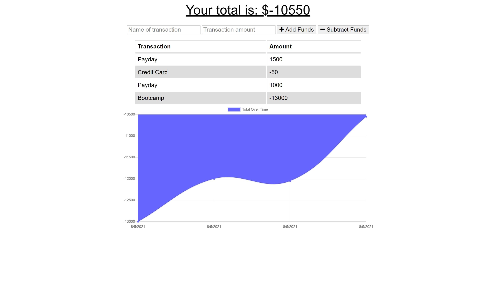

# Progressive Budget

## Assignment
Allow for offline access and functionality for a budget tracker application where the user is able to add expenses and deposits and see a visual representation of funds.

## User Story

AS AN avid traveller
I WANT to be able to track my withdrawals and deposits with or without a data/internet connection
SO THAT my account balance is accurate when I am traveling

## Acceptance Criteria

GIVEN a user is on Budget App without an internet connection
WHEN the user inputs a withdrawal or deposit
THEN that will be shown on the page, and added to their transaction history when their connection is back online.

## Live App

[Deployed Link](https://boiling-caverns-49681.herokuapp.com/)

